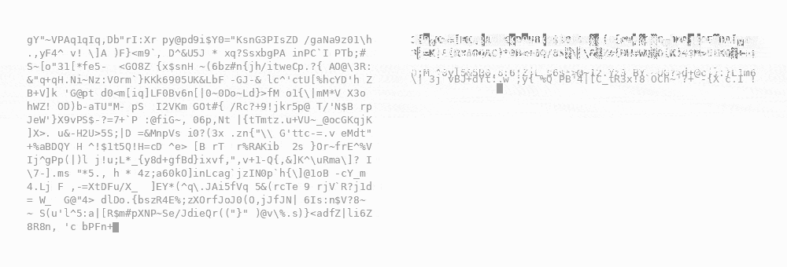

<p align="center">
  
</p>

# Relay

Relay is transparent context management for append-only OpenAI Responses API
agent loops. Use it as a Python client wrapper or an OpenAI-compatible proxy.

## Install

```bash
pip install -e .
```

RLM support uses the authors' official package:

```bash
pip install -e '.[rlm]'
```

## Python

Wrap a synchronous OpenAI client and keep the rest of the agent loop unchanged:

```python
from openai import OpenAI
from relay import Checkpoint, wrap

client = wrap(
    OpenAI(),
    Checkpoint(),
    checkpoint_mode="cache",
)

trajectory = [{"role": "user", "content": "Build the project"}]
response = client.responses.create(model="your-model", input=trajectory)
trajectory.extend(response.output)
```

`wrap()` returns a client-compatible view and does not modify the original
client. Only `client.responses` is context-managed.

## Proxy

For agents that cannot accept a wrapped client, run Relay as a server:

```bash
export RELAY_STRATEGY=checkpoint
export RELAY_CHECKPOINT_MODE=cache
relay
```

Point the agent at Relay without changing its loop:

```bash
export OPENAI_API_KEY=...
export OPENAI_BASE_URL=http://127.0.0.1:8787/v1
your-agent
```

## Configuration

| Strategy | Python | `RELAY_STRATEGY` | Behavior | Configuration |
| --- | --- | --- | --- | --- |
| Compact | `Compact()` | `compact` | Replace active context with a compacted checkpoint. | `RELAY_COMPACT_THRESHOLD=120000` |
| Checkpoint | `Checkpoint()` | `checkpoint` | Create chunk checkpoints, then replace old chunks as context grows. | `RELAY_CHECKPOINT_THRESHOLD=30000`<br>`RELAY_CONTEXT_THRESHOLD=120000` |
| Sliding window | `SlidingWindow()` | `sliding_window` | Keep the longest tool-safe suffix. | `RELAY_SLIDING_WINDOW_TOKENS=120000` |
| Rolling memory | `RollingMemory()` | `rolling_memory` | Recursively update working memory while keeping the newest tool-safe segment verbatim. | `RELAY_MEMORY_MODEL`<br>`RELAY_MEMORY_MAX_OUTPUT_TOKENS=4000`<br>`RELAY_MEMORY_UPDATE_INPUT_TOKENS=120000` |
| RLM | `RLM()` | `rlm` | Run the official Recursive Language Model over the full request, then render its result as one Responses turn. | `RELAY_RLM_MODEL`<br>`RELAY_RLM_MAX_DEPTH=1`<br>`RELAY_RLM_MAX_ITERATIONS=30`<br>`RELAY_RLM_ENVIRONMENT=local`<br>`RELAY_RLM_MAX_TIMEOUT`<br>`RELAY_RLM_MAX_TOKENS` |
| Context Folding | `ContextFolding()` | `context_folding` | Hide branch control, then replace a completed branch with its return report. | `RELAY_CONTEXT_FOLDING_MODEL`<br>`RELAY_CONTEXT_FOLDING_MAX_OUTPUT_TOKENS=2000`<br>`RELAY_CONTEXT_FOLDING_MAX_BRANCH_STEPS=200`<br>`RELAY_CONTEXT_FOLDING_MAX_BRANCH_TOKENS=32768`<br>`RELAY_CONTEXT_FOLDING_MAX_BRANCHES=10` |
| AgentFold | `AgentFold()` | `agent_fold` | Maintain official-style multi-scale summaries plus one raw latest interaction. | `RELAY_AGENT_FOLD_MODEL`<br>`RELAY_AGENT_FOLD_MAX_OUTPUT_TOKENS=4000` |
| AutoCompact | `AutoCompact()` | `auto_compact` | Let a manager choose task-aware compaction points; keep the initial task and recent interactions verbatim. | `RELAY_AUTO_COMPACT_MODEL`<br>`RELAY_AUTO_COMPACT_FALLBACK_THRESHOLD=120000`<br>`RELAY_AUTO_COMPACT_KEEP_RECENT=2`<br>`RELAY_AUTO_COMPACT_MIN_INTERACTIONS=1`<br>`RELAY_AUTO_COMPACT_MAX_OUTPUT_TOKENS=4000` |
| PRO-LONG | `ProLong()` | `prolong` | Keep a lossless structured log; a private resumable model searches it with Read/Grep/Python equivalents and supplies context to the passive task model. | `RELAY_PROLONG_MODEL`<br>`RELAY_PROLONG_CONTEXT_THRESHOLD=120000`<br>`RELAY_PROLONG_MANAGER_COMPACT_THRESHOLD=120000`<br>`RELAY_PROLONG_MAX_OUTPUT_TOKENS=4000`<br>`RELAY_PROLONG_MAX_STEPS=6`<br>`RELAY_PROLONG_ENABLE_PYTHON=true` |

| Checkpoint mode | Python | Environment | Behavior |
| --- | --- | --- | --- |
| Cache | `checkpoint_mode="cache"` | `RELAY_CHECKPOINT_MODE=cache` | Store artifacts in Relay's exact-prefix cache without changing agent responses. |
| Inline | `checkpoint_mode="inline"` | `RELAY_CHECKPOINT_MODE=inline` | Return Relay checkpoint items for the agent to append to its trajectory. |

Cache mode is recommended for transparent integration. Inline checkpoints are
Relay-specific and require Relay to remain in the request path when replayed.

RLM follows the official fresh-query behavior: every request processes the full
trajectory with `persistent=False` and `compaction=False`. It does not create or
reuse Relay checkpoints. Its manager model uses Chat Completions; the original
request model remains the Responses renderer. The default `local` RLM environment
executes model-generated Python in the Relay process; use an isolated official
RLM environment for untrusted workloads.

Context Folding follows FoldAgent's branch/return state transition, but Relay's
branch decision is hidden from the task trajectory. AgentFold follows the
official multi-scale summary update and applies each fold to the next turn.
AutoCompact follows its published inference behavior; its project currently
does not publish inference code or model weights, so Relay uses a hidden manager
for the learned compact/keep decision.

PRO-LONG follows the official lossless-log design, adapted so the task model
never performs context-management actions. A private model inherits the task
context, keeps its own replayable Responses trajectory, and searches the full
structured log programmatically. Relay preserves native compaction items for
both model trajectories and stores the external log in the exact-prefix cache.
Set `RELAY_PROLONG_MODEL` to a smaller Responses model; when unset, Relay uses
the task model. `log_python` executes manager-generated local Python and should
be disabled for untrusted workloads with `RELAY_PROLONG_ENABLE_PYTHON=false`.

Sources: [PRO-LONG](https://github.com/alexisfox7/PRO-LONG),
[FoldAgent](https://github.com/sunnweiwei/FoldAgent),
[AgentFold](https://github.com/Alibaba-NLP/DeepResearch/tree/main/WebAgent/AgentFold),
and [AutoCompact](https://autocompact.github.io/).

## Codex

Start Relay with the API key Codex already uses:

```bash
export OPENAI_API_KEY=...
export RELAY_CHECKPOINT_MODE=cache
relay
```

Add a provider to `~/.codex/config.toml`:

```toml
model_provider = "relay"
model_auto_compact_token_limit = 1000000000

[model_providers.relay]
name = "Relay"
base_url = "http://127.0.0.1:8787/v1"
env_key = "OPENAI_API_KEY"
wire_api = "responses"
supports_websockets = false
```

Run Codex normally. Relay uses the Responses SSE transport and keeps its
checkpoints in the local exact-prefix cache. The high Codex compaction limit
keeps Codex's own compactor from replacing the append-only trajectory first.
