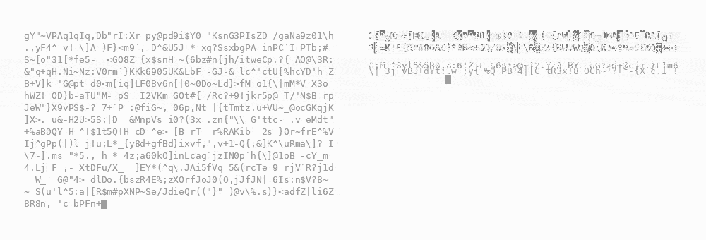

<p align="center">
  
</p>

# Relay

Relay is a context-management layer between agent harnesses and model APIs. It
runs as a local proxy: the harness keeps its normal append-only loop and sends its
whole history on every request; Relay decides what the model actually sees and
forwards that instead. One strategy written against Relay's protocol-neutral view
therefore works for every supported harness and model. Where a harness offers a native
hook, the same strategy can run through it instead (see [Integration paths](#integration-paths)).

The first strategy is **Codex-style context compaction**: when the prompt reaches a
threshold, the history is summarized with Codex's own compaction prompt and replaced
by the initial context, the most recent user messages, and the summary.

## Quickstart

```bash
pip install -e .
relay serve &              # http://127.0.0.1:8787
relay install codex        # or: claude, gemini_cli, pi, opencode, kilo, crush,
                           #     openclaw, kimi_code, goose
codex                      # use the harness exactly as before
relay uninstall codex      # restore its configuration
relay install claude --via hook   # Claude Code: its compaction hook instead of the proxy
```

`relay install` edits the harness's own configuration file. It wraps whatever endpoint
the harness is configured with (or its default): the setting becomes
`http://127.0.0.1:8787/up/<id><original path>`, and Relay forwards `/up/<id>/...` to the
original host. Logins, API keys, gateways and provider choices keep working; previous
values are recorded in `~/.config/relay/installed.json` for `relay uninstall`.

| Harness | Setting written by `relay install` |
| --- | --- |
| Codex | `openai_base_url` in `~/.codex/config.toml` (built-in provider; ChatGPT login or API key) |
| Claude Code | `env.ANTHROPIC_BASE_URL` in `~/.claude/settings.json` |
| Gemini CLI | `GOOGLE_GEMINI_BASE_URL` in `~/.gemini/.env` (API-key mode) |
| pi | `providers.{openai,anthropic,google}.baseUrl` in `~/.pi/agent/models.json` |
| OpenCode / Kilo | `provider.{openai,anthropic,google}.options.baseURL` in `opencode.json` / `kilo/config.json`, plus `compaction.prune = false` |
| Crush | `providers.<id>.base_url` in `~/.config/crush/crush.json` |
| OpenClaw | `models.providers.{openai,anthropic,google}.baseUrl` in `~/.openclaw/openclaw.json` |
| Kimi Code | `providers.<id>.base_url` in `~/.kimi-code/config.toml` |
| Goose | `OPENAI_HOST` / `ANTHROPIC_HOST` / `GOOGLE_HOST` in `~/.config/goose/config.yaml` |
| Hermes Agent | `model.base_url` in `~/.hermes/config.yaml`, plus the protocol Hermes would have picked from the original host (`api_mode: codex_responses` for api.openai.com; Gemini's OpenAI-compatible endpoint for Google) |
| nanobot | `providers.{openai,gemini,anthropic}.apiBase` in `~/.nanobot/config.json`, plus `apiType: responses` for a provider that was talking to api.openai.com |
| DeepSeek Harness | `llm-deepseek` `baseURL` and existing `llm-pi-ai` routes in `~/.dsh/cordis.patch.yml` |
| WorkBuddy / CodeBuddy Code | `url` of each custom model in `~/.workbuddy/models.json` / `~/.codebuddy/models.json` |
| mini-swe-agent | `OPENAI_BASE_URL` / `GEMINI_API_BASE` / `ANTHROPIC_BASE_URL` in its global `.env` (read by litellm) |

`relay run <harness> -- <args>` runs Codex or Claude Code through a private, temporary
Relay instead. `relay install` also turns the harness's own auto-compaction off, so Relay's
strategy is the one that runs (see [Harness auto-compaction](#harness-auto-compaction));
`relay uninstall` restores it.

## Architecture

```
 harness request ─► codec (protocol) ─► harness profile ─► Request ─► strategy ─► Context
                    items, media,        injected context,   the conversation:    the items the
                    legal cuts           identity, state     as sent, as seen     model sees
 upstream ◄─ codec (written, checked) ◄─ harness profile (its own items placed) ◄────┘
```

Three layers keep strategies free of harness and protocol details:

- the **codec** knows the wire protocol: items (their text and media), legal cuts, how a
  message is written, how an item gets new content with its structure kept (a tool result
  still answers its call), which items the API would reject where they stand (a call without its
  result), and where it allows system messages;
- the **harness profile** knows what the harness writes itself: which items are injected
  context (`refine`), what makes two requests the same conversation for the prefix store
  (`identity`, robust to instructions re-rendered in place and resumed histories), the
  harness's current state (`state`: its instructions, environment, modes at their latest
  version), where that state goes after a compaction (`place`), and which requests are the
  harness compacting itself (`compacting`: they get the stored context but never a new one);
- the **strategy** sees only the conversation (user, assistant, tool items and summaries)
  and decides, on every request, what the model sees. The harness's own items are put back
  into every answer where the harness sent them (after a summary, where the harness puts its
  state after its own compaction), so a new strategy inherits that, and cache hits, for free.

| Module | Responsibility |
| --- | --- |
| `relay/core/ir.py` | The strategy contract: `Item` (kind, text, media), `Request` and `Context`. Items keep a reference to their wire item, so whatever a strategy keeps is forwarded byte-for-byte. |
| `relay/protocols/` | One codec per wire protocol (OpenAI Responses, OpenAI Chat Completions, Anthropic Messages, Gemini): item kinds and text, legal cut points (never between a tool call and its result), prefix canonicalization, synthetic messages, summary requests, usage and overflow errors. |
| `relay/harnesses/` | Harness profiles: injected context, conversation identity, current state and its placement, the harness's own compaction requests, detection from request headers, and the settings `relay install` writes. |
| `relay/install.py` | `relay install` / `uninstall`: reversible edits of JSON, TOML, YAML and `.env` config files, and the endpoint mounts Relay forwards. |
| `relay/strategies/` | Strategies. `compaction.py` ports Codex's local compaction; `clm.py` lets the model edit its own context (Context Language Models); `folding.py` folds the branches an agent returns from (Context Folding); `prolong.py` keeps a session log the agent searches (PRO-LONG). |
| `relay/core/engine.py` | Per-request orchestration: restore the stored context, estimate tokens, ask the strategy, place the harness's own items, check the result, remember. It records each request's cache decision (matched depth) and warns when a request no longer reaches its conversation's last stored context, with the item where it diverged. Strategy failures never reach the harness; the request is forwarded with the last good context. |
| `relay/core/store.py` | Exact-prefix store (a trie over item identities): a context computed for one request is found again by every later request that extends the same history, including other conversations forked from it (sub-agents). Relay keeps no other session state. |
| `relay/providers.py` | Upstream routing (installed mounts, else by path) and model context windows. |
| `relay/transport/proxy.py` | The HTTP proxy. Responses, including streams, are relayed unchanged. |
| `relay/integrations/` | Integration paths: the proxy, and native hooks (Claude Code's compaction hook and its plugin). Each maps a strategy onto a harness: what `relay install` writes, and for a hook, the harness's transcript as a `Request`. |
| `relay/transport/hooks.py` | The endpoint hooks call (`/relay/v1/compact`), served by `relay serve` next to the proxy. |

### Integration paths

A strategy is written once, against the `Request`, and decides on every request; an integration
path decides how that runs inside a harness. Every path shows the strategy the conversation before
every request, makes its context take effect, and makes the summaries it asks for. The **proxy**
does it in every harness: the harness keeps its full history, Relay stores the context and applies
it to each request. A **hook** runs inside the harness and leaves its model endpoint alone; a
compaction hook writes the context into the harness's own history, which then serves as the store
(there `history` is the transcript as it stands, so it equals `current`).
The paths differ in what they can see and write, never in what the strategy decides: a compaction
hook sees the harness's transcript (not its system prompt, tools or injected context), keeps
messages whole or writes text messages, and every change is a real compaction to the harness (it
re-injects its context, shows it, keeps it on resume). What a path cannot carry fails loudly
instead of being dropped. Each harness lists its paths in order of preference,
and `relay install --via auto` takes the first; `--via proxy|hook` names one.

**Claude Code's compaction hook** (`relay install claude --via hook`, Claude Code 2.1.274+): the
install enables a function-hook plugin (an early-access feature, switched on by
`CLAUDE_CODE_ENABLE_FUNCTION_HOOKS`), moves Claude Code's auto-compaction trigger to the bottom
(`CLAUDE_AUTOCOMPACT_PCT_OVERRIDE=0.01`, its window left as it is), and leaves `ANTHROPIC_BASE_URL`
alone, so Remote Control (which refuses any other endpoint) and every login keep working. Claude
Code then compacts, through the hook, before every request: the plugin posts the transcript and the
size of Claude Code's last request to Relay, and the strategy decides on it as it would through
the proxy, on that size plus what was added since. "Not now" skips the compaction (it leaves
nothing in the transcript or the requests); a new context is kept by Claude Code, which
re-injects its own context after it. Claude Code would have compacted at the latest 33k tokens below
its window and blocks a few thousand later, so past that the strategy decides as if forced. The summary
request is `$.model.fork`: the conversation as Claude Code last sent it (system prompt, tools,
history, its latest reply) with Codex's prompt after it, which is Codex's own summary request;
tool results not sent yet (mid-turn) follow in that prompt as text. The fork reaches the trigger
too and runs uncompacted, as Codex's summary request does. A history a fork cannot see (a
sub-agent's, or one a resumed process compacts before its first request) is summarized from a
rendering in a plain completion. When Relay does not answer, nothing happens, unless Claude Code is
near its own limit, where its own compaction runs. The hook carries the conversation and the
strategy's state (kept by Relay per session and agent); a strategy's instructions, its notes (see
CLM) and new content for a message Claude Code keeps make the hook fail, so such a strategy runs
through the proxy. Claude Code's function hooks could carry instructions too (`prompt.section`
adds to a system-prompt section); that is not used yet. Proxy stays Claude Code's
default path: it follows Codex's timing exactly and continues each sub-agent's own conversation
for its summary. Whether Claude Code's interactive UI shows a low-context warning with the trigger
at the bottom is not verified.

Checked in Docker (`check.py --via hook claude_code:gpt`, Relay off the model path and a second,
non-compacting Relay recording it): Claude Code asked before every request and the strategy
compacted only at its own threshold (30k: at 31.0k, 32.7k and 31.0k; with the current contract
again at 31.0k at a turn start, and at 30.8k and 33.4k mid-turn with `--file-lines 200`), at a turn
start and mid-turn (`--file-lines 240`), each with one summary request, a fork of the whole conversation (at a turn
start in a process that had already sent requests; `claude -c` starts a new one, which fell back to
the rendering); every summary kept the codes read, later requests carried only the latest summary
and none of the summarized output, Claude Code never compacted on its own, nothing was read twice,
and both answers were right.

Other harnesses' native interfaces, for later paths: OpenClaw's `contextEngine` plugin slot
(`assemble` builds each request, `compact` owns compaction), pi's extensions (`context` and
`before_provider_request` rewrite each request, `session_before_compact`), Hermes Agent's context
engine and request middleware, OpenCode and Kilo's `experimental.chat.messages.transform`, DeepSeek
Harness's compaction backends, mini-swe-agent's model class. Codex, Gemini CLI, Kimi Code,
CodeBuddy, Goose and Crush only offer hooks that observe or block (Gemini CLI's `BeforeModel` sees
text parts only), so they run through the proxy.

Relay never translates between protocols: a request is forwarded in the protocol the
harness spoke. Models are reached through any provider that serves that protocol.

Token counts come from the usage the upstream reported for the previous request of the
same conversation plus an estimate of the new items, so no extra token-counting calls are
made. The estimate (all of it when nothing was reported yet: a conversation's first
request, or after Relay joined late, restarted, or the harness compacted itself) counts
four bytes of text per token, as Codex does (OpenAI and Gemini tokenizers measured about
4.6, so it errs high), or 2.5 for Claude (measured 2.7), and counts opaque content the
model still reads (encrypted reasoning and compactions, redacted thinking, thought
signatures) at its decoded size. If the upstream still rejects a
request as too long, Relay compacts and retries it once.

## Compaction

Behavior follows `codex-rs/core/src/compact.rs`; prompts are vendored verbatim in
`relay/prompts/`.

- Compaction triggers at 90% of the model's context window (`RELAY_COMPACT_THRESHOLD` or
  `RELAY_COMPACT_GROWTH` override this), and always at 95% of the window.
- The summary request is the harness's own request with the history so far and
  Codex's compaction prompt as the last user message, sent to the same upstream (with
  tools disabled). It shares the previous request's prefix, so provider prompt caching
  applies. Like Codex's `drain_to_completed`, a summary counts only if its response
  completed: a stream cut short or a response stopped by a token limit is retried (up to
  5 times) and never used. A history too long for one summary request (Relay joined a
  long session late, dropped out for a while, or restarted and lost its state, while the
  harness kept and resends everything) is summarized in order, a piece at a time, each
  piece after the summary so far: the skipped compactions, caught up. The same happens if
  the upstream reports an overflow.
- The new context follows Codex's replacement history: the newest real user messages up
  to `RELAY_RETAIN_USER_TOKENS` (the oldest one kept is truncated in the middle; media is
  reduced to text; earlier summaries are dropped) and the summary as a user message
  starting with Codex's summary prefix. Mid-turn (the request ends with tool results)
  everything is summarized, the initial context sits just above the last real user
  message and the summary comes last. At the start of a turn the summary covers the
  history before it, the initial context is re-injected after the summary, and the new
  turn follows verbatim.
- The initial context is what the harness injected before the model's first action:
  system messages and context messages (environment, instructions, `<system-reminder>`
  blocks). Like Codex, which rebuilds it from session state, Relay takes it from the
  harness's own history, which is resent with every request, so it survives any number of
  compactions. System messages (Codex's base instructions) stay first, except on the
  Anthropic API, where a `system` message may only precede the model's turn: there it
  follows a mid-turn summary and waits for the next mid-turn compaction after a turn start.

### Harness state

Harnesses tell the model about their state (instruction files, environment, date, modes,
memory, MCP servers) in three ways, and each needs a different treatment for the compacted
context to describe the session as it is now:

| Where the state is | Harnesses | What Relay does |
| --- | --- | --- |
| Fields sent with every request (top-level system prompt, instructions, tools) | Hermes Agent, nanobot, mini-swe-agent; Claude Code's and Gemini CLI's system prompts | Nothing to do: these are forwarded as sent. |
| A first message re-rendered in place | OpenCode, Kilo, Crush, OpenClaw, Goose (system message with AGENTS.md / SOUL.md / `.goosehints`); Gemini CLI (`<session_context>` in the first user message); WorkBuddy (rules and memory in the first user message) | Prefix matching compares those items by position and user messages without the injected blocks (`Harness.identity`), so the compaction survives the change; the current version is what gets forwarded. |
| Updates appended to the history | Codex (world-state sections); pi (a new system prompt on resume); Kimi Code (date and mode reminders); DeepSeek Harness (runtime snapshots, changed instruction files); Claude Code (MCP instructions as system messages) | The profile re-renders the initial context at compaction: Codex merges its section updates like Codex does; the others name each piece of state (`Harness.state_key`) and the latest version of each is re-injected. |

Claude Code's other updates (instruction files re-read on resume, reminders) arrive inside
user messages, which compaction keeps. Notifications (background tasks finishing) are
events, not state, and are left to the summary.

Sub-agents and multi-agent sessions need no special case: every sub-agent seen (Codex,
Gemini CLI, OpenCode, Kilo, Crush, OpenClaw, Goose, Kimi Code, DeepSeek Harness, WorkBuddy,
Hermes) runs its own conversation through the same Relay, and the prefix store keeps one
compaction per conversation, matched by its own history. A sub-agent forked from its
parent's history (Codex `fork_turns`) extends the parent's prefix and so starts from the
parent's compaction.

Deliberate differences from Codex: a compaction that would free less than
`RELAY_COMPACT_MIN_GAIN` of the threshold is skipped, so a threshold set close to the
fixed prompt overhead (system prompt and tools) does not trigger a summary on every
request; the summary request keeps the tool definitions with tool calls disabled
(Anthropic rejects tool history without them) where Codex sends none; a history too long
for one summary request is summarized piece by piece instead of dropping its oldest items;
and an empty summary is a failed compaction rather than "(no summary available)".

## Context Language Models

`RELAY_STRATEGY=clm` lets the model manage its own context, as in
[Context Language Models](https://arxiv.org/abs/2609.37725) (`relay/strategies/clm.py`). Before
every request the conversation is mirrored to a file; the model edits it with its ordinary tools
(a Python one-liner, `sed`, its file-edit tool); on the next request the edited file is its
context. What the model reads follows the paper's harness (facebookresearch/context-language-models):
its "Managing your context" section added to the system prompt, the size readout ending every
request (`[context: ~N/limit tokens]`), nudges at 25%, 50% and 75% of the budget (from 50% with the
paper's note contract: copy facts forward, mark values verified, end with a NEXT line; at 75% "do
not wipe"), an urgent nudge on every request past 90% of the limit, and the paper's default edit
gate, which refuses an edit that grows the context past the limit. The system prompt and the
original task are protected, as there: they stay out of the file. The file's format follows pi-clm,
the authors' adaptation of CLM to a coding harness: a metadata line, then one
`[[CTX_TURN ... id=...]]` block per turn. Untouched blocks stay the original items, byte for byte
(tool calls, reasoning and images intact); an edited user, assistant or tool-result turn keeps its
place with the new text (a result still answers its call, and keeps its images); an edited tool
call or reasoning item, and every block the model adds (`id=new-*`, any role label), becomes a
user-role note labelled with the role; a tool call left without its result (or the reverse), or
reasoning away from the item it preceded, is told as a note when the request is sent, and nothing
else changes (the codec knows how its protocol pairs calls: removing one of several parallel calls
leaves the others calls). A file without block headers replaces everything after the task with one
note. The edited context is stored like any other, so it holds for every later request of the
conversation; the harness's own context (instructions, environment, reminders) stays out of the
file and where the harness sent it, which also keeps the system prompt's cache. Two changes adapt the paper's loop, which ran until the task was submitted, to
chat harnesses, which end the turn on the first reply without a tool call: the instructions say
that receipts, readouts and nudges come from the context manager and that the user's request
goes on after them, and the urgent nudge says "compact … before anything else, … then continue
the task" where the paper says "do nothing else". Requests that offer no tools (titles, quota
checks) are left alone, and each conversation (a sub-agent's too) has its own file.

Verified in Docker. `check.py --strategy clm --clm-edit` tells the model exactly what to edit (delete
file_2's call and output, rewrite file_1's output, add a marker block) and then asks it, without
reading anything, what it sees; it checks that Relay applied every accepted edit faithfully, that
the result is what was asked on every later request, and that the model sees it. Every accepted
edit was applied faithfully in all 19 harness/model pairs. The result was exactly what was asked,
and seen so, in 13: Codex, Claude Code, OpenCode, Kilo, OpenClaw, Goose, Kimi Code, Hermes and
mini-swe-agent on GPT, and Gemini CLI, pi, Goose and Crush on Gemini. In Crush and WorkBuddy the
edit was right, but the model read file_2 again although told not to. In pi and nanobot the model
read the three files with parallel calls; once file_2's call went, the rest of that group became
notes (the text right, the calls no longer calls), which Relay no longer does: only the items the
protocol cannot keep are told as notes now. Gemini CLI driven through LiteLLM to GPT never edited
the file, because LiteLLM keeps only the first part of a Gemini system instruction and Relay had
added its guidance as a second one; it joins the last part now, and the run passes. The paper-style task (`--strategy clm`, a 26k budget and its nudges)
passed for Codex (7 edits over 27 requests) and Claude Code (6 over 21): the models mostly
shortened old tool results in place, their calls still structured calls.

**Steering.** As in the paper (§5.2), a policy in words changes how the model manages its
context: `RELAY_CLM_STEERING` adds one to the guidance. `tests/docker/steering/` holds briefs that
imitate other strategies, and `check.py --strategy clm --steering NAME` checks each accepted edit
against the shape the brief asks for. On the file-reading task, with nudges off (backup with
them on), the edits that followed their brief, for Codex / Claude Code / pi:

| Brief | Asks for | Codex | Claude Code | pi |
| --- | --- | --- | --- | --- |
| `compaction` | nothing below 20k tokens, then one handoff summary in place of everything | 2/2 | 3/3 | 1/1 |
| `masking` | tool results cut to one line, nothing deleted or added | 7/7 | 5/6 | 0/1 |
| `memory` | after each file, one memory block in place of everything | 7/7 | 6/6 | 1/1 (1 edit, not 3) |
| `sliding_window` | the oldest turns deleted, nothing written or retold | 1/5 | 2/3 | no edit |
| `backup` | a copy of the context file before every edit | 8/8 | 9/9 | 1/1 |

Without a brief the same models first shorten tool results in place, then collapse everything
into notes. Policies that keep what the task needs were followed; under the sliding window, once
deleting would lose the codes, Codex and Claude Code wrote a note anyway, and where they did not,
they answered with codes they made up. pi edited least, and late.

Limits: Relay must run on the machine whose files the harness's tools edit (the paper's sandbox
mirror); the edit is read back at the next request, so the turn that made it stays in the context
until the model removes it (as in pi-clm); revisions are also checkpointed beside the context files
(`.checkpoints/`, readable by their owner only), so a restarted Relay restores them when the harness
resends the history they were made on (not a history the harness has since rewritten); through
Claude Code's hook the instructions and notes cannot be delivered, so CLM runs through the proxy.

## Context Folding

`RELAY_STRATEGY=folding` lets the agent branch off a sub-task and come back with a message, as in
FoldAgent ([github.com/sunnweiwei/FoldAgent](https://github.com/sunnweiwei/FoldAgent),
`relay/strategies/folding.py`). The harness's own shell stands in for FoldAgent's `branch` and
`return` tools: the guidance asks the agent to run `echo "[branch] <description> :: <task>"`, work on
the sub-task, and run `echo "[return] <message>"`. The echo's result is rewritten in place:
FoldAgent's branch message ("ROLE CHANGE: `MODE: BRANCH`" and the task) when the branch opens, and
"Branch has finished its task, the returned message is: ..." when it returns, when the branch's
steps and the return call fold away. Nothing before the branch call changes, so the upstream's
prompt cache serves it on the request after the fold. A branch cannot open another (FoldAgent's
rule). The conversation itself says which branches are open or done; the strategy keeps no state.

Checked in Docker with `check.py --strategy folding` (read file_1, read file_2 and file_3 in a
branch and return their codes, read file_4; then say, without reading, whether file_2's text is
still there). The branch opened and folded in 18 of 19 harness/model pairs: Codex, Claude Code, pi,
OpenCode, Kilo, Crush, OpenClaw, Goose, Kimi Code, Hermes, nanobot, DeepSeek Harness, WorkBuddy and
mini-swe-agent on GPT, and Gemini CLI, pi, Goose and Crush on Gemini. Every later request kept the
returned codes and neither file's text, and the model answered right and no longer saw file_2. On
the request after the fold the upstream's cache served 69% to 98% of the prompt where it reports
cache use (Codex 86%, Claude Code 89%, Gemini CLI on Gemini 72%). Gemini CLI on GPT, which had not
been told about branches (see the LiteLLM note under CLM), used its own sub-agent tool
(`invoke_agent`); told, it branches and folds too. Codex at times reaches for its `spawn_agent`. The signal is read from the echo's output in whatever
form a harness reports it (plain, JSON, `Command: … Output: …`), else from the call.

## PRO-LONG

`RELAY_STRATEGY=prolong` gives the agent durable memory, as PRO-LONG does
([github.com/alexisfox7/PRO-LONG](https://github.com/alexisfox7/PRO-LONG), `relay/strategies/prolong.py`):
every event of the session (user prompts, the agent's messages, tool calls and results) is appended
to one local log (`RELAY_PROLONG_LOG`, PRO-LONG's JSONL format), and PRO-LONG's skill tells the agent
to search only what it needs there with `rg`, `grep`, `jq` or a script. The log never enters the
prompt, and reading it is not recorded. PRO-LONG writes the log from each harness's hooks; Relay
writes it from the requests, so it works in every harness. It matters once the context loses
something, so it runs around compaction (the `RELAY_COMPACT_*` settings apply): compaction decides
what the model sees, the log keeps everything.

Checked in Docker with `check.py --strategy prolong`: each file also names an animal, which turn 1
does not ask for and turn 2 does, after a compaction, without the files. In all 18 two-turn
harness/model pairs the log held every event once and no read of itself, and the skill reached
every request; the summaries had dropped the animal. Codex, Claude Code, OpenCode, Kilo, Crush,
OpenClaw, Goose, nanobot and DeepSeek Harness on GPT, and Gemini CLI, pi, Goose and Crush on Gemini
searched the log and answered right, and so do Gemini CLI on GPT (once the skill reached it past
LiteLLM) and pi (once its own system prompt survived compaction, and with the same reasoning effort
as Codex: it had run with low). So do the last three, once the test was fair: WorkBuddy once its
model reasons (see ³ below; without reasoning it never looked), and Kimi Code and Hermes once the
question named the line (`file N animal: …`; every line of the files mentions a fox and a dog, and
Kimi Code had answered one of them). Hermes first searches its own session history, then the log,
and never reopens file_2 (the check had taken that search's query for a read).

## The CLM paper's baselines

The CLM paper compares against methods that manage context through predefined actions or a
schedule the harness keeps. Each is a strategy here, in every harness (`relay/strategies/`); where a
method gives the model a tool, the harness's own shell stands in for it, as for Context Folding: the
guidance asks the agent to `echo` a signal, and the echo's result is rewritten in place.

| Baseline | `RELAY_STRATEGY` | What Relay does | Prompts |
| --- | --- | --- | --- |
| Summary | `compaction` with `RELAY_COMPACT_RATIO=0.75` | Codex's compaction at 75% of the budget (the paper's summary harness) | Codex's |
| Self-Compact ([arXiv 2606.23525](https://arxiv.org/abs/2606.23525)) | `selfcompact` | every two model responses once the prompt passes 37% of the window, appends the rubric to the conversation (prompt cache reused); C1 = C2 = C3 = Y and N1 = N fires the summarizer, and the summary replaces the trajectory (the user's messages stay); past 95% it summarizes without asking | the paper's rubric and summarizer, verbatim |
| AutoCompact ([autocompact.github.io](https://autocompact.github.io/)) | `autocompact` | the agent runs `echo "[compact]"` at a phase transition; the same model writes an "# Auto Context Summary", which answers the call, and the context becomes the user's messages, the turn before the call and the summary; Codex's compaction stays as the fallback (`RELAY_COMPACT_*`) | none released; written from its description |
| ACM ([github](https://github.com/lixiaochuan2020/agentic-context-management)) | `acm` | `echo "[manage_context]"` compresses everything since the previous call into "[summary_id: N] ...", the originals saved to `RELAY_ACM_DIR/<conversation>/summary_N.json`; `echo "[query_memory] N :: query"` answers from them; every request after a tool result ends with "[CURRENT CONTEXT TOKEN: N]" | ACM's summarizer and recall prompts, verbatim; its guidance worded for a shell |
| MEM1 ([github](https://github.com/MIT-MI/MEM1)) | `mem1` | the model writes its internal state in `<IS>` every response; the context is cut back to the newest response holding one (the user's messages stay) | MEM1's, for an agent's tools |
| RLM ([github](https://github.com/alexzhang13/rlm)) | `rlm`, `rlm_persistent` | before every step the authors' RLM works out the agent's next step, the conversation held as `context` in its REPL; its answer is all the task's model sees of the conversation, and that model, with the harness's tools, takes the step. `rlm` is a fresh query every request (the whole conversation again, nothing cached); `rlm_persistent` is the authors' multi-turn mode: the conversation's REPL stays, each request adds only what is new as `context_k`, and earlier work stays in `history_k` and in the model's variables | the authors' (`rlms` 0.1.3); the root prompt asks for the next step |
| Context Folding | `folding` | see above | FoldAgent's |

Base is Relay without a strategy that changes anything. AutoCompact and MEM1 train their models to
the behavior; an untrained model gets the guidance alone, so whether it compacts at the right
moment, or writes its internal state at all, is the model's.

The RLM runs inside Relay (`pip install 'relay[rlm]'`; `relay/strategies/rlm.py`): every model call
it makes, the root's and the sub-calls', goes to the task's own model through the harness's
upstream and credentials, with the RLM's instructions and no tools (`Summarizer.complete`). Its
`local` environment runs the model's code in Relay's process, so it can read and change whatever
Relay can (in the tests Gemini read the project's files itself); `RELAY_RLM_ENVIRONMENT=docker`
uses the authors' Docker environment. It cannot run through Claude Code's hook, which can only continue
the harness's own conversation. Through the Responses API, gpt-6 writes its plan and its code as
commentary before a final answer, and repeats it at times: the RLM gets every message once, which it
needs (from the final answer alone, or with the repeats, it did not converge).

Checked in Docker with `check.py --strategy rlm|rlm_persistent` (read three files, one per call, and
give their codes; turn 2 asks for them again without reading). `rlm` passed in Codex, pi and Claude
Code on GPT: before every step the RLM ran (14–31 of its own model calls per run), the step's model
saw only its result, and both answers were right. In WorkBuddy two of the RLM's calls through
LiteLLM ran past Relay's 10-minute read limit, and Relay forwarded those steps unchanged (answers
right); gemini-3.8-flash, in Gemini CLI, almost never submitted through `answer` (375 calls over 18
steps, some answers unfinished, those steps forwarded unchanged). `rlm_persistent` worked out every
step of turn 1 in Codex, but on turn 2, with the user's new message in the newest `context_k`, the
model spent all 30 turns piecing the contexts together and never submitted; the authors' package
with its own client does the same with this model, so it is the mode's, not Relay's. gpt-6 follows
the `answer` protocol unevenly in any case: the authors' client, alone, has needed 3 to 31 calls
for the same step.

Checked in Docker on 19 harness/model pairs each (`check.py --strategy selfcompact|autocompact|acm|mem1`;
Gemini was overloaded during much of it, answering 503s; failed pairs were run again):

- **Self-Compact** (the default task, window 40k): the rubric was asked and fired, and the summary
  replaced the trajectory, in every pair; the model then finished with all eight codes in 18 (all
  but pi on Gemini, whose runs kept meeting Gemini's 503s). On this task the rubric fires at nearly
  every probe (C1–C3 Y, N1 N). Gemini CLI on Gemini passed once Gemini was not overloaded (before,
  it gave up on requests held 46–113 s while the probe and summary waited on 503s). Through Claude Code's hook it runs too (the harness's own model answers the rubric, then
  summarizes; checked with `--via hook`), as it needs no instructions or notes.
- **AutoCompact** (compact after reading three files): the compact call was answered by the
  summary, the turn before it kept, and the files before it gone, and the answers were right, in 18
  pairs. Gemini CLI on Gemini reads the three files in one turn (twice), so that turn, the one kept,
  holds all three.
- **ACM** (compress three reads, then recall an animal the summary dropped): in all 19 pairs the
  reads were compressed into "[summary_id: 1]" with the originals saved, query_memory recalled the
  animal from them, the context size reached every request, and the answers were right.
- **MEM1** (the default task): the context was cut back to the newest internal state on every
  request in 18 pairs (Chat Completions, Anthropic and Gemini carry the model's text in the same
  message as its calls, where MEM1 reads it), and the model, carrying the codes only there, finished
  right in 15: Codex, pi, OpenCode, Kilo, Crush, OpenClaw, Goose, Kimi Code, nanobot, DeepSeek
  Harness, WorkBuddy and mini-swe-agent on GPT, and Gemini CLI, Crush and Goose on Gemini. Claude
  Code and Gemini CLI on GPT dropped the first codes from their own internal state, twice each
  (Claude Code's model called them "not verified in this turn"; LiteLLM, between them and OpenAI,
  forwards the state); Hermes's model wrote states that were not cumulative and made codes up (in
  another run its `read_file` answered a repeated read with "File unchanged since last read",
  pointing at content MEM1 had removed); pi on Gemini met Gemini's 503s.

## Configuration

| Variable | Default | Meaning |
| --- | --- | --- |
| `RELAY_STRATEGY` | `compaction` | The strategy: `compaction` (Codex's), `clm` (the model edits its own context), `folding` (the agent branches and returns), `prolong` (compaction, and a log the agent searches), or one of the CLM paper's baselines: `selfcompact`, `autocompact`, `acm`, `mem1`, `rlm`, `rlm_persistent`. |
| `RELAY_RLM_MAX_ITERATIONS`, `RELAY_RLM_MAX_DEPTH` | `30`, `1` | RLM: root turns per step, and recursion depth (1: sub-calls are plain model calls), the authors' defaults. |
| `RELAY_RLM_ENVIRONMENT` | `local` | RLM: where the model's code runs; `local` is Relay's own process. |
| `RELAY_ACM_DIR` | `/tmp/.acm` | ACM: where the compressed messages are saved, a folder per conversation (Relay reads them back for `query_memory`). |
| `RELAY_PROLONG_LOG` | `/tmp/.prolong/log.jsonl` | PRO-LONG: the session log; the harness's tools must be able to read it (Relay writes a `.gitignore` next to it). |
| `RELAY_COMPACT_THRESHOLD` | `RELAY_COMPACT_RATIO` × context window | Prompt tokens that trigger compaction. |
| `RELAY_COMPACT_RATIO` | `0.9` | Share of the model's context window used when no threshold is set. |
| `RELAY_COMPACT_GROWTH` | unset | Instead of a threshold, compact after this many tokens were added since the context window began (Codex's `BodyAfterPrefix` scope); independent of each harness's fixed prompt overhead. |
| `RELAY_CONTEXT_WINDOW` | from the model name | Overrides the context window table in `relay/providers.py`. |
| `RELAY_RETAIN_USER_TOKENS` | `20000` | Budget for recent user messages kept verbatim. |
| `RELAY_CLM_BUDGET` | context window | CLM: the context budget the model is told about; its limit is this less `RELAY_CLM_RESERVE` (`2048`). |
| `RELAY_CLM_DIR` | `/tmp/.live_ctx` | CLM: where the context files live; the harness's tools must be able to edit files there (inside the workspace for a sandboxed harness; Relay writes a `.gitignore` there). |
| `RELAY_CLM_STEERING` | unset | CLM: a file holding a context-management policy in words, added to the model's guidance (see `tests/docker/steering/`). |
| `RELAY_CLM_NUDGES` | `on` | CLM: `off` drops the budget nudges (the size readout stays), as in the paper's steering runs. |
| `RELAY_COMPACT_MIN_GAIN` | `0.1` | Skip compactions that free less than this share of the threshold (or growth). |
| `RELAY_OPENAI_BASE_URL` | `https://api.openai.com/v1` | Upstream for the Responses API. |
| `RELAY_ANTHROPIC_BASE_URL` | `https://api.anthropic.com` | Upstream for the Messages API. |
| `RELAY_OPENAI_API_KEY`, `RELAY_ANTHROPIC_API_KEY` | unset | Replace the harness's credentials for that upstream. |
| `RELAY_HARNESS` | detected | Force a harness profile by name, e.g. `codex`, `hermes`, `generic`. |
| `RELAY_EVENT_LOG` | unset | Append one JSON line per compaction (sizes, timing, the new head). |
| `RELAY_HOST`, `RELAY_PORT` | `127.0.0.1`, `8787` | Server address for `relay serve`. |
| `RELAY_CACHE_MAX_ENTRIES`, `RELAY_CACHE_MAX_BYTES`, `RELAY_CACHE_TTL_SECONDS`, `RELAY_CACHE_SECRET` | `4096`, 256 MiB, 6 h, random | Limits of the in-memory prefix store. |

Set `RELAY_CONTEXT_WINDOW` to the window the harness itself uses (Codex's catalog gives the
gpt-5.6 and gpt-6 families 272k by default, shown as 258k usable): the table covers older
models only, an unknown model falls back to 128k, and the 95% limit uses the same window, so
setting only a threshold is not enough. Relay's threshold must also stay below the
harness's own trigger (see [Harness auto-compaction](#harness-auto-compaction)).

Other providers are configured by endpoint, for example
`RELAY_OPENAI_BASE_URL=https://api.x.ai/v1` for Grok, or
`RELAY_OPENAI_BASE_URL=https://openrouter.ai/api/v1` /
`RELAY_ANTHROPIC_BASE_URL=https://openrouter.ai/api` with the matching `*_API_KEY` for
OpenRouter.

## Support

Checked in Docker against real models with `tests/docker/check.py`: a two-turn session
compacting every 5k new tokens, so each run compacts at least twice mid-turn and once at
a turn start, with every compaction checked (summary content, Codex layout, initial
context kept, latest instructions forwarded; see [Development](#development)). Between
the turns the project's instruction files change, and turn 2 hands work to a sub-agent
where the harness has one:

| Harness | Protocol | GPT | Gemini | Claude |
| --- | --- | --- | --- | --- |
| Codex 0.160 | Responses | ✅ ChatGPT login | | |
| Claude Code 2.1.283 | Messages | ✅ via LiteLLM² | | ✅ subscription login |
| Gemini CLI 0.62 | Gemini | ✅ via LiteLLM² | ✅ | |
| pi 1.0 | Responses / Gemini | ✅ | ✅ | |
| OpenCode 1.18 | Responses / Gemini | ✅ | ⚠️¹ | |
| Kilo CLI 7.8 | Responses / Gemini | ✅ | ✅ | |
| Crush 0.97 | Chat Completions / Gemini | ✅ | ✅ | |
| OpenClaw 2026.9 | Responses / Gemini | ✅ | ✅ | |
| Goose 1.52 | Responses / Gemini | ✅ | ✅ | |
| Kimi Code 2.1 | Responses / Gemini | ✅ | ✅ (gemini-2.5-flash-lite) | |
| Hermes Agent 0.19 | Responses / Chat Completions | ✅ | ✅ | |
| nanobot 0.3.5 | Responses / Chat Completions | ✅ | ✅ | |
| DeepSeek Harness 0.2 | Responses / Gemini | ✅ | ✅ | |
| WorkBuddy (CodeBuddy Code 2.161) | Chat Completions | ✅³ | ✅ | |
| mini-swe-agent 2.4 | Responses / Gemini | ✅⁴ | ✅⁴ | |

Models: `gpt-6-luna`, `gemini-3.8-flash`, `claude-sonnet-5-5` unless noted. Some
harness/model pairs fail without Relay too and were tested with the closest model the
harness supports: Kimi Code requests a thinking level gemini-3.8-flash rejects.
¹ Every compaction passes the checks, but when Gemini answers with nothing but a thought,
OpenCode sends a request that ends with that model turn, which Gemini rejects; the same
task fails the same way without Relay, so the run does not finish.
² The harness was already configured to use a LiteLLM gateway that translates its protocol to
OpenAI; `relay install` wrapped that gateway (harness → Relay → LiteLLM → OpenAI). Relay does
not translate protocols itself.
³ WorkBuddy is a desktop app; its engine ships as the CodeBuddy Code CLI, which was run on
`~/.workbuddy`. Built-in models go through Tencent's service and cannot be managed; custom
models can, through Chat Completions only. gpt-6 accepts tools on Chat Completions only with
`reasoning_effort: none` (CodeBuddy itself drops the effort for api.openai.com), so WorkBuddy is
pointed at a LiteLLM gateway that sends its requests to the Responses API, where the model reasons
(`--effort medium`); run without reasoning, the model refused to answer from summaries or its
own earlier context. Every harness runs gpt-6 at medium effort (nanobot and DeepSeek Harness set
it explicitly; Claude Code asks for high itself).

⁴ One turn: mini cannot continue a session, so the turn-start path is not exercised.

After the strategy contract became `Request` → `Context` the matrix ran again: every GPT row
passed (Hermes on a second run: its first ended while a background sub-agent was still working),
and so did Gemini CLI, pi (second run, after a 503 from Gemini), Crush, Goose, Hermes, nanobot,
DeepSeek Harness and WorkBuddy on Gemini. The other Gemini runs failed for the model or the
harness, not the context Relay sent: OpenCode as in ¹; Kilo, an OpenCode fork, the same way
(answers of nothing but a thought) and once on a summary response that never finished (Relay
kept the last context); OpenClaw only on when it crossed the budget (four compactions, all
mid-turn); and Kimi Code's gemini-2.5-flash-lite and Kilo's gemini-3.8-flash dropped codes when
re-summarizing a summary that held them, so the model read those files again.

Resumed sessions keep their compaction: several harnesses rewrite their history when a
session is resumed without changing what the model reads (Codex writes absent reasoning
content as null, Gemini CLI repeats tool results and replaces thought signatures, OpenClaw
drops reasoning summaries, Hermes drops tool names, CodeBuddy adds its own metadata), and
the codecs compare items by what reaches the model, so the stored compaction still
applies. Claude Code can leave earlier tool calls out of a resumed history; that is a
different history, so Relay summarizes it again.

Hermes Agent and nanobot choose their protocol from the endpoint's host name, which is why
`relay install` pins it for them. Hermes ignores Anthropic endpoints on hosts it does not
recognize, so its native Anthropic provider is not supported. DeepSeek models on DeepSeek
Harness were not checked (no key), but use the same Messages codec as Claude Code.

Cursor, Windsurf, Amp and similar products route model requests through their own
servers, so a local proxy cannot manage their context. (Cursor Agent's `--endpoint`
exchanges the API key with Cursor's backend first, and the desktop app's OpenAI base-URL
override did not reach a local endpoint.)

Beyond the matrix: `--subagent` (a sub-agent reads three files, so its own conversation
compacts) passed for Codex, Claude Code, OpenCode, Kilo, Crush, Goose, Kimi Code, DeepSeek
Harness and WorkBuddy; `--window` (Relay's own 90% trigger on a small window) for pi, Codex
and Claude Code; `--native-compact` (Claude Code's own `/compact` between the turns, whose
history then starts with Claude Code's summary) for Claude Code. Hermes Agent's background
sub-agents do not run under `hermes chat -q`, which exits with the turn. Kimi Code and Hermes
Agent keep the instructions they loaded when a session is resumed (the request itself still
carries the old version), so they answer with the old codename;
`gemini-2.5-flash-lite` on Kimi Code sometimes re-reads files and writes summaries that miss
facts, with or without earlier summaries in view.

Realistic sessions (`tests/docker/session.py`): a real repository (more-itertools with a
planted bug) and four turns over the harness's own resume: a tour of the code, a bug fix
with a regression test, a feature after a changelog rule is added to the instructions, and
a summary of the session; hidden checks then test the fix (beyond the repository's own
tests), the feature, its stub, tests and changelog entry, the full suite, and that the
summary recalls both changes. Every harness that resumes a session passed with compaction
on (WorkBuddy with plan mode off: run headless, it waits for a plan approval that cannot
come, with or without Relay), as did Codex and
Claude Code with Relay joining late, dropping out for a turn, or restarting before every
turn (histories up to five times the window were caught up in pieces); with the tickets
coming from an MCP server, a mockup image to look at and a release to look up; with the
session forked after turn 3 and, in Claude Code, rewound to the end of turn 2 (each branch
found the compaction of the history it shares); and with the harness's own compaction
firing first (Codex's server-side `compaction_trigger`, Claude Code's `/compact`).

Remote Control: Codex's (`codex app-server --remote-control`, driven from the ChatGPT app)
reaches its service at `chatgpt_base_url` and the model at `openai_base_url`, so it works
through Relay. `check.py codex:remote` runs the session through `tests/docker/codex_remote.py`,
a stand-in for the service and the app (nothing is enrolled with the account; the rest of
the ChatGPT backend is passed through to chatgpt.com); it passed, and the app shows the full
conversation, its context meter the compacted size. Claude Code's (`claude remote-control`)
refuses to start while `ANTHROPIC_BASE_URL` points anywhere but api.anthropic.com, so it does
not run through the proxy; `relay install claude --via hook` leaves the endpoint alone and runs
the strategy through Claude Code's compaction hook instead (see [Integration paths](#integration-paths)).

Harness-side context management changes history Relay has stored: OpenCode prunes old
tool outputs, which `relay install` turns off, and Gemini CLI masks them, which no setting
stops, so its profile compares tool results by their call and the prefix still matches.

### Harness auto-compaction

Left on, a harness's own compaction runs first wherever its trigger is at or below Relay's
(Codex compacts before the request that would cross a tie), or where it measures its own
history, which keeps growing behind Relay (Hermes Agent); the session still goes on, but
with the harness's summaries instead of Relay's. `relay install` turns it off, through a
switch where there is one and otherwise by moving the trigger out of reach (10⁹ tokens):

| Harness | Its own trigger | `relay install` sets |
| --- | --- | --- |
| Codex | `model_auto_compact_token_limit`, capped at 90% of `model_context_window` (server-side `compaction_trigger`) | both to 10⁹; Codex caps the window at the model's maximum, so its trigger moves to 90% of that: 784.8k for the gpt-6 family, but 244.8k for gpt-5.5, whose maximum is its default (keep Relay's threshold below it) |
| Claude Code | near the window | `env.DISABLE_AUTO_COMPACT=1` in `settings.json` (`/compact` still works) |
| WorkBuddy, CodeBuddy | forced at 92% of a model's `contextWindow` or `maxInputTokens` (this build runs no other) | `autoCompactEnabled: false`, `env.CODEBUDDY_AUTOCOMPACT_PCT_OVERRIDE=100` |
| Gemini CLI | 50% of the window | `model.compressionThreshold: 10⁹` |
| pi | the window minus a reserve | `compaction.enabled: false` |
| OpenCode, Kilo | the input limit minus a reserve | `compaction.auto: false` (and `compaction.prune: false`) |
| Crush | near the window | `options.disable_auto_summarize: true` |
| OpenClaw | the window minus a reserve | `agents.defaults.compaction.enabled: false` (overflow recovery and `/compact` stay) |
| Goose | 80% of the context limit | `GOOSE_AUTO_COMPACT_THRESHOLD: 0.99` (no switch; values outside (0, 1) may mean the default) |
| Kimi Code | 85% of a model's `max_context_size`, or within 50k of it | every model's `max_context_size: 10⁹` (it must be positive) |
| Hermes Agent | half its window (at least 75% below 512k), measured on its own history | `compression.enabled: false` |
| nanobot | `contextWindowTokens` | `agents.defaults.contextWindowTokens: 10⁹` (0 would starve its memory archive) |
| DeepSeek Harness | `compaction-basic` at 80%, with tool results trimmed first | `compaction-basic` `auto: false`, `tool-result-pruner` `thresholdChars: 10⁹` |
| mini-swe-agent | none | nothing |

Each was checked in Docker (`check.py --harness-compaction`): with the user's configuration
set to make the harness compact itself at about 20k tokens, it did; after `relay install`
it did not, and the task still finished. Hermes Agent, which refuses windows under 64k, was
checked in the realistic session, where it had compacted itself before.

Codex measures its context as the usage reported for its last request plus what it has added
since; that request is the one Relay compacted, so its trigger stays out of reach even when
its own history passes it. Checked with Codex's trigger at 25k and Relay's threshold at 16k:
Codex's history grew to 34k, the usage it was told stayed under 22k, and it never compacted
itself (in `codex exec` and under Remote Control); with Relay not compacting, it did.

Known limitations: state lives in memory, so a restart costs a catch-up summary per
conversation; WebSocket transports are refused (Codex falls back to HTTP); an overflow
reported inside an already-started stream is not retried; token-counting endpoints are
passed through unchanged; Gemini CLI's Google-login mode (Code Assist API) is not
covered yet.

## Extending Relay

- **Harness**: subclass `Harness` in `relay/harnesses/`: `matches` (request headers),
  `refine` and `injected` (what it writes into the conversation), and, where the defaults do
  not fit, `identity`, `state_key` or `state`, `place`, `compacting`; then `settings` for
  `relay install`. Add it to `HARNESSES`. Run `tests/docker/check.py --probe` to see where it
  keeps state, then a two-turn check, and turn the run into a replay fixture
  (`python -m tests.replay.build NAME HOME`): `tests/test_replay.py` is the contract every
  harness must meet (every request finds its stored compaction, the latest state reaches
  the model, the request stays well-formed).
- **Protocol**: implement the `Codec` interface in `relay/protocols/base.py` and register
  it in `CODECS`; add an upstream for it in `relay/providers.py`.
- **Strategy**: implement `Strategy`: `fingerprint()` and `plan(request, summarizer)`, which
  returns the `Context` the model sees from now on, or None to keep `request.current`. The
  `Request` holds the conversation only (no system or context items): `history`, every item as
  the harness sent it, and `current`, what the model sees if nothing changes (the last context,
  then what came since); `boundaries`, the cuts that keep each tool call with its result; the
  token count, window, `force` and the strategy's own `state` from the previous request. The
  `Context` is a tuple of items, in any order: items from the request, as they are or
  `dataclasses.replace`d with new text or media (a tool result stays the answer to its call),
  and new ones; a new SYSTEM item joins the system prompt, and a SUMMARY marks a compaction (the
  harness's state goes where the harness puts it after its own). Add `state` for the next
  request and `notes` for this one only. `summarizer.summarize(cut, prompt)` asks the task's
  own model about `current[:cut]`; `summarizer.complete(items)` asks it anything else, with
  instructions of its own and no tools. Register it in `STRATEGIES` (`RELAY_STRATEGY`). To give the
  model an action without a new tool, have it echo a signal through the harness's shell and rewrite
  the echo's result (`relay/strategies/conversation.py`, as Context Folding, AutoCompact and ACM do).

```python
@dataclass(frozen=True)
class DropMiddle:  # keep the task and the last 20 items once the context is large
    threshold: int = 100_000
    name: str = "drop_middle"

    def fingerprint(self):
        return {"name": self.name, "threshold": self.threshold}

    def plan(self, request, summarizer):
        if request.tokens < self.threshold:
            return None
        task = next(n for n, item in enumerate(request.current) if item.kind is Kind.USER)
        cut = max(b for b in request.boundaries if b <= len(request.current) - 20)
        if cut <= task + 1:
            return None
        note = Item(Kind.USER, f"[{cut - task - 1} earlier items were removed]")
        return Context((*request.current[: task + 1], note, *request.current[cut:]))
```

The earlier strategies (checkpoint, sliding window, rolling memory, RLM, context
folding, AgentFold, AutoCompact, selective discard, PRO-LONG, multi-granularity
compaction) live unchanged in `relay/experimental/` until they are ported to this
interface.

## Development

```bash
pip install -e '.[dev]'
pytest                                  # unit, fake-upstream and replay tests (real sessions of every harness)
```

Real harnesses are checked in Docker against real models, with a low compaction
threshold so a short task compacts several times. The image holds the harness CLIs;
each run gets a throwaway HOME, so the host's own configurations are never touched.

```bash
docker build -t relay-harness-test tests/docker
RELAY_TEST_KEYS=keys.env python tests/docker/check.py pi:gpt          # one harness × model
RELAY_TEST_KEYS=keys.env python tests/docker/check.py --matrix        # all of them
```

`keys.env` holds `OPENAI_API_KEY`, `GEMINI_API_KEY` and `ANTHROPIC_API_KEY`; Codex uses
a copy of the host's ChatGPT login with its refresh token voided, so a container can never
rotate the token the host holds. Each run is two turns of one session (the second through the
harness's own continue/resume), so Relay compacts mid-turn and at the start of a turn.
A run passes only if, for every compaction, the summary contains every code read so far,
the new context has Codex's layout and keeps the initial context (at its latest state) and
user messages, and every later request of that conversation that Relay forwarded carries
just its latest summary and none of the summarized tool output; the harness's latest
instructions reach the model; no conversation read a file twice; both answers are right;
no compaction failed; and the upstream accepted every model call. `--probe` records a
session without compacting, to see where a harness keeps its state. `--via hook` installs
through the harness's hook (Claude Code), with a second Relay recording the model calls;
`--file-lines N` makes the files longer.

```bash
RELAY_TEST_KEYS=keys.env python tests/docker/session.py codex:gpt-api --repo PATH --window 32000
    # --baseline | --transition late-join|drop-out|restart | --tools | --branch | --harness-compact N
```

runs the realistic session described under [Support](#support) and
prints its hidden checks with Relay's record of it (compactions per turn, summary requests
per compaction, cache hits, divergences, the harness's own compactions).
